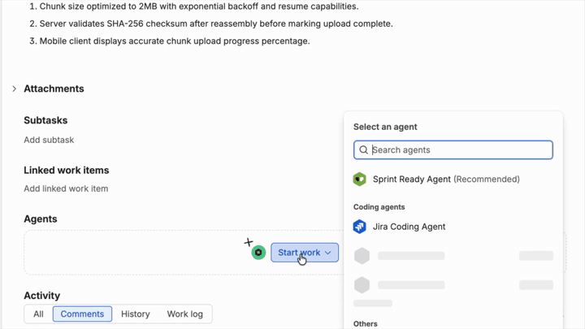

# Implementation Plan Agent — Forge Workshop

[](../LICENSE) [](../CONTRIBUTING.md)

> Part of the [**Forge Inspired**](../README.md) collection.

**A hands-on workshop for building a Rovo agent on Atlassian Forge.** Participants start from the vanilla `rovo-agent-rovo` template and evolve it into an agent that reads a Jira issue's context, drafts an implementation plan grounded in the organization's knowledge, and posts the plan back as a single comment on the issue.



## Two apps in one folder

| Folder | What it is | When to use it |
|--------|------------|----------------|
| [`baseline/`](./baseline) | Untouched output of `forge create -t rovo-agent-rovo`. Just logs a message to Forge logs. | Your **starting point** — this is what everyone sees in step 1 of the workshop. Deploy it, poke it, then build on it. |
| [`solution/`](./solution) | The finished workshop app: a Rovo agent with two `action`s (`inspect-issue` + `post-implementation-plan`). | Your **reference** — deploy this if you want to see the finished result, or peek at it if you get stuck. |

Both are independent Forge apps with their own `manifest.yml`, `package.json`, and app id — they are deployed and installed separately.

## What you'll build

By the end of the workshop you'll have a Rovo agent that you can call from Rovo Chat or from the **Agents** panel on any Jira issue. Ask it to plan an issue and it will:

1. Read the issue via the `inspect-issue` action (summary, description, type, status, priority, assignee, reporter, labels — no custom fields).
2. Draft an implementation plan with four sections: **Context**, **Proposed approach**, **Implementation steps**, **Risks & open questions**. Rovo's built-in access to your organization's knowledge grounds the plan in real team practice.
3. Post the plan back to the same Jira issue as a **single comment**, using the `post-implementation-plan` action.
4. Reply in chat with a deep link to the new comment.

## Prerequisites — get your machine ready

You need three things before you can run either app:

### 1. Node.js and the Forge CLI

- Install **Node.js LTS** (v20 or newer). The Forge runtime is Node 24, but the CLI itself runs on any modern LTS.
- Install the Forge CLI globally:
  ```bash
  npm install -g @forge/cli
  ```
- Verify it's on your PATH:
  ```bash
  forge --version
  ```

### 2. An Atlassian account and API token

- Log in to Forge with an API token from https://id.atlassian.com/manage-profile/security/api-tokens:
  ```bash
  forge login
  ```
- You should see a "Logged in" message. Confirm with:
  ```bash
  forge whoami
  ```

### 3. A Jira Cloud site

- Any Jira Cloud site you're an admin on will work. If you don't have one, create one by running:
   ```bash
  forge site provision
  ```

### 4. (Optional) Skip local setup with the Forge Codespace

Prefer not to install Node and the Forge CLI on your laptop? Use the community **[Forge Codespace](https://github.com/ccurti-dx/forge-codespace/tree/main)** — a preconfigured GitHub Codespace with Node and the Forge CLI already set up. Once you're in the Codespace, `git clone` this repo and `cd` into `implementation-plan-agent/baseline` (or `solution`) to deploy.

## The workshop flow

Pick a track:

### Track A — Build from the baseline (recommended for the workshop)

```bash
cd implementation-plan-agent/baseline
npm install
forge register        # First time only — writes YOUR app id into manifest.yml
forge deploy
forge install         # Pick your Jira Cloud site
```

Open Rovo Chat on your site, pick the **baseline** agent, and ask it to log a message. You should see the message appear in `forge logs`.

Now the fun part: evolve `baseline/` into the finished app. Compare with [`solution/`](./solution) as you go. The key steps are:

1. Rewrite the `rovo:agent` prompt in `manifest.yml` to describe what the agent should do.
2. Replace the single `hello-world-logger` action with two actions: `inspect-issue` (a `GET`) and `post-implementation-plan` (a `TRIGGER`).
3. Add the `read:jira-work`, `read:jira-user`, and `write:jira-work` scopes.
4. Write the two action handlers in `src/`, using `@forge/api`'s `asUser().requestJira(...)` to call the Jira REST API.
5. `forge deploy && forge install --upgrade` (the upgrade is needed because you changed scopes).

### Track B — Just run the finished solution

```bash
cd implementation-plan-agent/solution
npm install
forge register        # First time only — writes YOUR app id into manifest.yml
forge deploy
forge install         # Pick your Jira Cloud site
```

Then on any Jira issue:

1. Open the ticket's **Agents** panel (or open Rovo Chat).
2. Choose **Implementation Plan Agent**.
3. Say something like `Plan PROJ-123 for me`.
4. Watch the agent read the issue, draft the plan, and post it back as a comment. The chat reply links straight to the new comment.

## Troubleshooting

- **The agent doesn't show up in Rovo.** Confirm your site has Rovo enabled and that `forge install` succeeded on the site you're testing. Try `forge install list` to check.
- **Scope errors after adding scopes.** You need to `forge install --upgrade` (not just re-deploy) whenever you change `permissions.scopes` in `manifest.yml`.
- **Nothing happens when you invoke the action.** Tail the logs: `forge logs --since 15m`. The action handler will log any error it hits.
- **`forge lint` complains about the manifest.** Manifests are strict YAML. Check indentation and make sure every `function` key referenced from an `action` exists under `modules.function`.

## Under the hood

- **Modules:** [`rovo:agent`](https://developer.atlassian.com/platform/forge/manifest-reference/modules/rovo-agent/) + [`action`](https://developer.atlassian.com/platform/forge/manifest-reference/modules/action/) × 2 + [`function`](https://developer.atlassian.com/platform/forge/manifest-reference/modules/function/).
- **Scopes:** `read:jira-work`, `read:jira-user`, `write:jira-work`. Only `post-implementation-plan` ever exercises the write scope.
- **The interesting files (in `solution/`):**
  - `manifest.yml` — agent prompt + action definitions + scopes.
  - `src/actions/inspect-issue.js` — the read path.
  - `src/actions/post-implementation-plan.js` — the sole write path (one POST to `/rest/api/3/issue/{key}/comment`).
  - `src/jira.js` — tiny shared helpers (`baseUrlFromSelf`, `adfToText`, `textToAdf`).

## License

Apache 2.0 · [LICENSE](../LICENSE) · Contributions welcome — see [CONTRIBUTING.md](../CONTRIBUTING.md).
