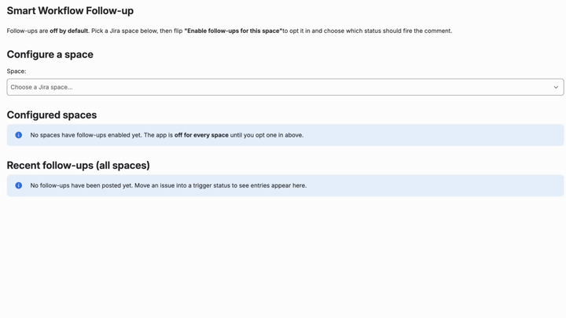

# Smart Workflow Follow-up — Forge Demo App

[](../LICENSE) [](../CONTRIBUTING.md)

> Part of the [**Forge Inspired**](../README.md) collection.

**Automatically post the same follow-up comment on every Jira issue that hits the status you care about — with issue-specific variables filled in per issue, per-project opt-in, and every comment auditable in-app.**



## What this demonstrates

- **React to real product events with zero infrastructure.** A Forge `trigger` subscribes to Jira issue events and runs on Atlassian's platform — no queues, no cron, no server.
- **Safe by default.** The app is off in every project until an admin explicitly turns it on, and every posted comment is auditable in-app. Disabling it silently drops future events.
- **Non-developers tune it.** Templates + insert-variable buttons let any admin change the comment shape without touching code.

## What you'll walk away with

- A working example of a Forge `trigger` reacting to real Jira workflow events.
- The pattern of pairing a single global admin page with per-project settings backed by `storage:app`.
- A small template + variable system that lets non-developers edit output without a code change.

## Get it running

> **Prerequisite:** your Forge setup is complete — see [Build and launch your Forge app → Choose your build path](https://developer.atlassian.com/platform/forge/build-and-launch/). New to the collection? [Start here](../README.md#start-here).

```bash
cd smart-workflow-followup
npm install
forge register       # first time only — writes an app.id into manifest.yml
forge deploy
forge install        # Jira only
```

Then, in Jira:

1. Open **Apps → Smart Workflow Follow-up** in the top nav — the app's only page.
2. Pick a project, flip **Enable follow-ups for this project** on, and choose the trigger status.
3. Write the comment. Click **+ Issue key**, **+ Person's name**, or **+ Issue summary** to insert variables. Watch the live preview.
4. Save & enable. Every future issue that hits that status posts your comment within seconds — with a full audit feed below.

## Under the hood

- **Modules:** [`jira:globalPage`](https://developer.atlassian.com/platform/forge/manifest-reference/modules/jira-global-page/) + [`trigger`](https://developer.atlassian.com/platform/forge/manifest-reference/modules/trigger/) + [`function`](https://developer.atlassian.com/platform/forge/manifest-reference/modules/function/) × 2.
- **Scopes:** `read:jira-work`, `read:jira-user`, `read:project:jira`, `write:jira-work`, `storage:app`. The write scope only ever posts comments — the app never modifies issue fields, statuses, or workflow.
- **The interesting files:** `src/trigger.js` (event filter + comment post + audit write), `src/frontend/globalPage.jsx` (config UI + audit feed), `src/templates.js` (default template + variable definitions — safe to edit).

## Make it yours

- **Change the default comment** — edit `DEFAULT_TEMPLATE` in `src/templates.js`.
- **Add a new insertable variable** (e.g. `{{previousStatus}}`, `{{priority}}`) — add an entry to `SUPPORTED_PLACEHOLDERS` in `src/templates.js` and populate the matching key in `src/trigger.js` where the template is rendered. Users get a new insert button in the editor automatically.

## License

Apache 2.0 · [LICENSE](../LICENSE) · Contributions welcome — see [CONTRIBUTING.md](../CONTRIBUTING.md).
