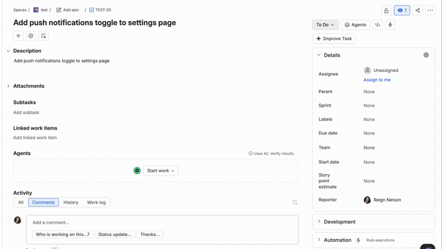

# Sprint Ready Agent — Forge Demo App

[](../LICENSE) [](../CONTRIBUTING.md)

> Part of the [**Forge Inspired**](../README.md) collection.

**A Rovo agent that reads a thin Jira ticket and rewrites it into a sprint-ready description — WHY, WHAT, HOW, open questions — with nothing written until you type `apply`.**



## What this demonstrates

- **AI native to the platform, not bolted on.** One `rovo:agent` module gives you both Rovo Chat *and* the Jira ticket Agents panel — same agent, two doorways, one deploy.
- **Read-heavy, write-tiny.** The agent reads freely from the ticket context, proposes a full rewrite in chat, and touches the ticket only after the human explicitly confirms.
- **The shape is a file, not a prompt.** A single markdown template controls what every generated description looks like — swap the file, change every future ticket.

## What you'll walk away with

- A working example of a `rovo:agent` with two `action` tools — one read (`GET`), one write (`TRIGGER`).
- The propose-then-confirm pattern for AI agents — how to design one that reads freely but only writes after the human agrees.
- A pattern for splitting **structure** (template) from **reasoning** (prompt) so each can be tuned independently.

## Get it running

> **Prerequisite:** your Forge setup is complete — see [Build and launch your Forge app → Choose your build path](https://developer.atlassian.com/platform/forge/build-and-launch/). New to the collection? [Start here](../README.md#start-here).

```bash
cd sprint-ready-agent
npm install
forge register       # first time only — writes an app.id into manifest.yml
forge deploy
forge install        # Jira only
```

Then, on any Jira ticket that's a bit sparse (one-line description, no acceptance criteria):

1. Open the ticket's **Agents** panel.
2. Click **Sprint Ready Agent → Prepare an issue for sprint planning**.
3. The agent reads the ticket and replies in chat with a full proposed rewrite — every template section populated, `## Open questions` flagging what it couldn't infer.
4. Reply **`apply`** to accept. The description updates in place.

> Same agent also works in **Rovo Chat** — pick the agent, say `Prepare PROJ-123 for sprint planning`, same flow.

## Under the hood

- **Modules:** [`rovo:agent`](https://developer.atlassian.com/platform/forge/manifest-reference/modules/rovo-agent/) + [`action`](https://developer.atlassian.com/platform/forge/manifest-reference/modules/action/) × 2 + [`function`](https://developer.atlassian.com/platform/forge/manifest-reference/modules/function/).
- **Scopes:** `read:jira-work`, `read:jira-user`, `write:jira-work`. The write scope is only ever exercised through `apply-changes`, and by design that action only touches the description field.
- **The interesting files:** `manifest.yml` (agent + prompt + actions), `src/templates/ticket-template.md` (the shape contract), `src/actions/apply-changes.js` (the sole write path).

## Make it yours

- **Change the shape of every generated description** — edit [`src/templates/ticket-template.md`](./src/templates/ticket-template.md).
- **Change what "sprint-ready" means to your team** — edit the `prompt:` block in `manifest.yml`.
- **Let the agent write more fields** (priority, labels, story points) — add inputs to the `apply-changes` action, handle them in `src/actions/apply-changes.js`, and teach the agent about them in the prompt. Redeploy + `forge install --upgrade` (action-input changes require a re-install).

## License

Apache 2.0 · [LICENSE](../LICENSE) · Contributions welcome — see [CONTRIBUTING.md](../CONTRIBUTING.md).
