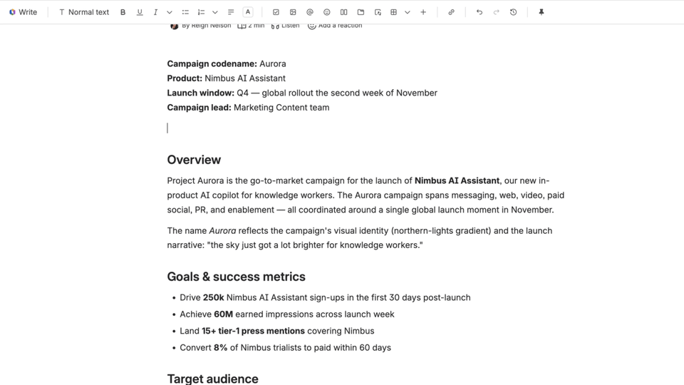

# Team Pulse Board — Forge Demo App

[](../LICENSE) [](../CONTRIBUTING.md)

> Part of the [**Forge Inspired**](../README.md) collection.

**A Confluence macro that finds every Jira ticket related to the page you're on — even when nobody has linked them. It extracts distinctive words from the page title, runs the JQL for you, and groups the results by status.**



## What this demonstrates

- **Cross-product in one Forge app.** A single macro reads Confluence page context *and* runs a live Jira JQL search — one manifest, one deploy, no glue.
- **Ambient context, not manual linking.** The connection between a Confluence page and its Jira work usually exists only in people's heads. This app surfaces it automatically from what's already on the platform.
- **Editable in the UI, not the code.** The match terms are a live chip UI — add or remove words and the search re-runs. No admin page, no config file.

## What you'll walk away with

- A working example of a Confluence macro that authors insert with `/`.
- A pattern for **cross-product reads** from a single Forge app (Confluence + Jira, one resolver).
- A live, editable UI in `@forge/react` — collapsible sections, chip lists, in-place refresh — with no external component library.

## Get it running

> **Prerequisite:** your Forge setup is complete — see [Build and launch your Forge app → Choose your build path](https://developer.atlassian.com/platform/forge/build-and-launch/). New to the collection? [Start here](../README.md#start-here).

```bash
cd team-pulse-board
npm install
forge register       # first time only — writes an app.id into manifest.yml
forge deploy
forge install        # install for BOTH Confluence and Jira
```

Then, on any Confluence page:

1. Type `/`, pick **Team Pulse Board**, and publish the page.
2. The macro extracts distinctive words from the page title into a **Matching on** chip row.
3. Related Jira tickets appear grouped by status (**To Do / In Progress / Done**) with linked keys, assignee avatars, and updated dates.
4. Click **+ Add word** to widen the search live, or click ✕ on any chip to remove it.

> **Need demo data?** Use [`prompts/seed-demo-data.md`](prompts/seed-demo-data.md) with Rovo Dev to seed a demo page + matching Jira tickets in about a minute.

## Under the hood

- **Modules:** [`confluence:macro`](https://developer.atlassian.com/platform/forge/manifest-reference/modules/confluence-macro/) + [`jira:globalPage`](https://developer.atlassian.com/platform/forge/manifest-reference/modules/jira-global-page/) + [`function`](https://developer.atlassian.com/platform/forge/manifest-reference/modules/function/).
- **Scopes:** `read:jira-work`, `read:jira-user`, `read:confluence-user`, `read:confluence-content.summary`, `read:page:confluence`. All reads only.
- **The interesting files:** `src/resolvers/page-context.js` (title-token extraction + JQL construction) and `src/frontend/index.jsx` (UI).

## Make it yours

- **Change how tokens are extracted from the title** — edit `extractTitleTokens()` in `src/resolvers/page-context.js`.
- **Add a different match signal** (custom field, label, explicit link) — add a clause to `buildJql()` in the same file.

## License

Apache 2.0 · [LICENSE](../LICENSE) · Contributions welcome — see [CONTRIBUTING.md](../CONTRIBUTING.md).
